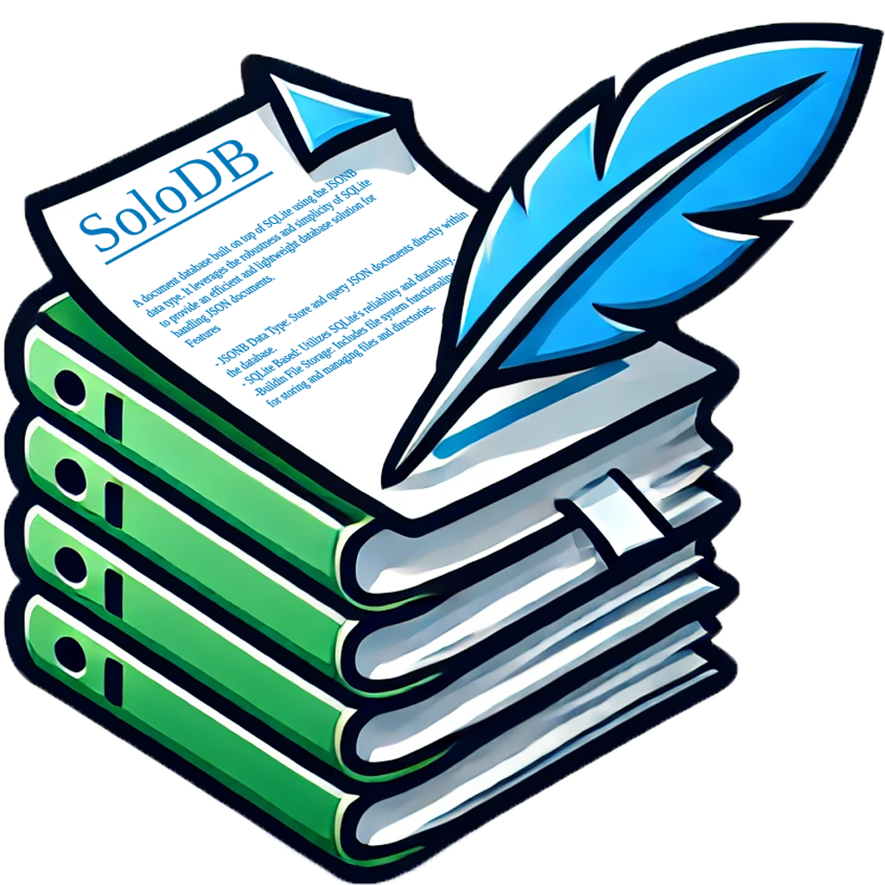

#  SoloDB

SoloDB is a light, fast and robust NoSQL and SQL embedded .NET database built on top of SQLite using the [JSONB](https://sqlite.org/jsonb.html) data type.

## Features

Imagine the power of MongoDB and SQL combined.

- [SQLite](https://sqlite.org/) at the core.
- Serverless, it is a .NET library.
- Simple API, similar to [LiteDB](https://github.com/mbdavid/LiteDB), see the [below](#usage).
- Thread safe using a connection pool.
- [ACID](https://www.sqlite.org/transactional.html) with [full transaction support](#transactions).
- [File System](./Tests/FileSystemTests.fs) for large files storage.
- Support for [polymorphic](./Tests/PolymorphicTests.fs) types.
- [Reliable](https://sqlite.org/hirely.html) with a [WAL log file](https://www.sqlite.org/wal.html).
- Support for [indexes](https://www.sqlite.org/expridx.html) for fast search.
- LINQ-like queries.
- [Direct SQL support](#direct-sqlite-access-using-dapper).
- [Open source](./LICENSE.txt).
- Pretty well tested: 160+ of mostly integration tests.

## Usage

Usage in SoloDB vs. other providers[\*](#footnote): [MongoDB](https://www.mongodb.com/docs/drivers/csharp/current/), [LiteDB](https://github.com/mbdavid/LiteDB).

### Initializing the Database

You can specify either a file path or an in-memory database.

#### SoloDB
```csharp
using var onDiskDB = SoloDB.Instantiate("path/to/database.db");
using var inMemoryDB = SoloDB.Instantiate("memory:database-name");
```

#### MongoDB
```csharp
var client = new MongoClient("mongodb://localhost:27017");
var database = client.GetDatabase("database-name");
```

#### [LiteDB](https://github.com/mbdavid/LiteDB/wiki/Getting-Started)
```csharp
using var db = new LiteDatabase(@"C:\Temp\MyData.db");
using var db = new LiteDatabase(new MemoryStream());
```

### Creating and Accessing Collections

#### SoloDB
```csharp
var myCollection = db.GetCollection<User>();
var untypedCollection = db.GetUntypedCollection("User");
```

#### MongoDB
```csharp
var myCollection = database.GetCollection<User>("User");
```

#### LiteDB
```csharp
var myCollection = db.GetCollection<User>("users");
```


### Checking Collection Existence

#### SoloDB
```csharp
var exists = db.CollectionExists<User>();
```

#### MongoDB
```csharp
var filter = new BsonDocument("name", "User");
var options = new ListCollectionNamesOptions { Filter = filter };
var exists = database.ListCollectionNames(options).Any();
```

#### LiteDB
```csharp
var exists = db.CollectionExists("users");
```

### Dropping Collections

#### SoloDB
```csharp
db.DropCollection<User>();
db.DropCollectionIfExists<User>();
db.DropCollection("User");
db.DropCollectionIfExists("User");
```

#### MongoDB
```csharp
database.DropCollection("User");
```

#### LiteDB
```csharp
db.DropCollection("users");
```


### Transactions

Use the `WithTransaction` method to execute a function within a transaction.

#### SoloDB
```csharp
db.WithTransaction(tx => {
    var collection = tx.GetCollection<ulong>();
    // Perform operations within the transaction.
    collection.Insert(420);    
    throw null; // Simulate a fail.
});
...
db.CollectionExists<long>() // False.
```

#### MongoDB
```csharp
using (var session = client.StartSession())
{
    var transactionOptions = new TransactionOptions(writeConcern: WriteConcern.WMajority);
    
    var result = session.WithTransaction(
        (s, ct) =>
        {
            collection1.InsertOne(s, new BsonDocument("abc", 1), cancellationToken: ct);
            collection2.InsertOne(s, new BsonDocument("xyz", 999), cancellationToken: ct);

            return "Inserted into collections in different databases";
        },
        transactionOptions,
        CancellationToken.None);
}
```

#### LiteDB
See the [ulong issue](https://github.com/mbdavid/LiteDB/issues/681).
```csharp
var created = ldb.BeginTrans();

db.GetCollection<ulong>().Insert(420);

db.Commit(); // Or ldb.Rollback();
```

### Direct SQLite access using [Dapper](https://github.com/DapperLib/Dapper)

#### SoloDB
```csharp
using var pooledConnection = db.Connection.Borrow();
pooledConnection.Execute(
"CREATE TABLE Users (\r\n    Id INTEGER PRIMARY KEY,\r\n    Name TEXT,\r\n    Age INTEGER\r\n)");

// Create a new user
var insertSql = "INSERT INTO Users (Name, Age) VALUES (@Name, @Age) RETURNING Id;";
userId = pooledConnection.QuerySingle<long>(insertSql, new { Name = "John Doe", Age = 30 });
Assert.IsTrue(userId > 0, "Failed to insert new user.");
```

#### MongoDB
```csharp
Does not support SQL.
```


#### LiteDB
It has [expressions](https://www.litedb.org/docs/expressions/).
```csharp
var reader = ldb.Execute("SELECT { upper_titles: ARRAY(UPPER($.Books[*].Title)) } WHERE $.Name LIKE \"John%\"");

while (reader.Read())
{
    Console.WriteLine(reader.Current.ToString());
}
```


### Backing Up the Database

You can create a backup of the database using the [`BackupTo`](https://www.sqlite.org/backup.html) or [`VacuumTo`](https://www.sqlite.org/lang_vacuum.html#vacuuminto) methods.

#### SoloDB
```csharp
db.BackupTo(otherDb);
db.VacuumTo("path/to/backup.db");
```

#### [MongoDB](https://www.mongodb.com/docs/manual/tutorial/backup-sharded-cluster-with-database-dumps/#back-up-a-sharded-cluster-with-database-dumps)
```javascript
// Stop the Balancer
sh.stopBalancer();
while( sh.isBalancerRunning().mode != "off" ) {
   print( "Waiting for Balancer to stop..." );
   sleep( 1000 );
}
// Lock the Cluster
db.getSiblingDB("admin").fsyncLock();

// Take Backup, run:
mongodump \
   --host mongos.example.net \
   --port 27017 \
   --username user \
   --password "passwd" \
   --out /opt/backups/example-cluster-1

// Unlock the Cluster
db.getSibling("admin").fsyncUnlock();
// Restart the Balancer
sh.startBalancer()

```
#### [LiteDB](https://github.com/mbdavid/LiteDB/issues/1809)
```csharp
db.Dispose();
// Yes, really.
File.Copy("path/to/database.db", "copy/location/backup.db");
```

### Optimizing the Database

The [`Optimize`](https://www.sqlite.org/pragma.html#pragma_optimize) method can optimize the database using statistically information, it runs automatically on startup.

#### SoloDB
```csharp
db.Optimize();
```

#### MongoDB
```csharp
Does not have a similar function.
```

#### LiteDB
```csharp
Could not find a similar function.
```

### File storage

#### [SoloDB](./Tests/FileSystemTests.fs)
```csharp
var fs = db.FileSystem;

// Supports directories.
var directory = fs.GetOrCreateDirAt("/example");

// Supports directory metadata.
fs.SetDirectoryMetadata(directory, "key", "value");
        
fs.Upload("/example/file.txt", new MemoryStream(randomBytes));
        
// Supports sparse files.
fs.WriteAt("/example/file.txt", /* offset */ 1000000, randomBytes, /* create if inexistent */true);

// Supports file metadata.
fs.SetMetadata("/example/file.txt", "key", "value");


using var toStream = new MemoryStream();
fs.Download("/example/file.txt", toStream);
var read = fs.ReadAt("/example/file.txt", 1000000, randomBytes.Length);

Assert.IsTrue(read.SequenceEqual(randomBytes));

var file = fs.GetOrCreateAt("/example/file.txt");

// Can list files and directories.
var fileFromListing = fs.ListFilesAt("/example/").First();
        
// Automatic SHA1 hashing.
Assert.IsTrue(file.Hash.SequenceEqual(fileFromListing.Hash));

var fileByHash = fs.GetFileByHash(fileFromListing.Hash);
```

#### MongoDB
```csharp
var gridFS = new GridFSBucket(database);

// Upload a file
using var stream = File.OpenRead("C:\\path\\to\\your\\file.txt");
var fileId = await gridFS.UploadFromStreamAsync("file.txt", stream);


// Download the file
using var ms = new MemoryStream()
await gridFS.DownloadToStreamByNameAsync("file.txt", stream);

```

#### [LiteDB](https://www.litedb.org/docs/filestorage/)
```csharp

var fs = db.FileStorage;
// Or gets a FileStorage with custom collection name
var fs = db.GetStorage<string>("myFiles", "myChunks");

// Upload a file from file system
fs.Upload("$/photos/2014/picture-01.jpg", @"C:\Temp\picture-01.jpg");
// Or
fs.Upload("$/photos/2014/picture-01.jpg", "picture-01.jpg", stream);

// Find file reference only - returns null if not found
LiteFileInfo file = fs.FindById("$/photos/2014/picture-01.jpg");

// Now, load binary data and save to file system
file.SaveAs(@"C:\Temp\new-picture.jpg");
// Or
file.CopyTo(Response.OutputStream);

// Find all files references in a "directory"
var files = fs.Find("$/photos/2014/");

// It also has OpenRead.
```

### Example Usage

Here is an example of how to use SoloDB to manage a collection of documents in C#:

#### SoloDB
```csharp
using SoloDatabase;
using SoloDatabase.Types;

public class MyType
{
    public SqlId Id { get; set; }
    public string Name { get; set; }
    public string Data { get; set; }
}


let db = SoloDB.Instantiate("./mydatabase.db")
var collection = db.GetCollection<MyType>();

// Insert a document
var docId = collection.Insert(new MyType { Id = 0, Name = "Document 1", Data = "Some data" });

// Or

var data = new MyType { Id = 0, Name = "Document 1", Data = "Some data" };
collection.Insert(data);
Console.WriteLine("{0}", data.Id); // 2

// Query all documents into a C# list
var documents = collection.Select().OnAll().Enumerate().ToList();

// Query the Data property, where Name starts with 'Document'
var documentsData = collection.Select(d => d.Data).Where(d => d.Name.StartsWith("Document")).ToList();

data.Data = "Updated data";

// Update a document
collection.Update(data);

// Delete a document
var count = collection.DeleteById(data.Id); // 1
```
#### MongoDB
```csharp
using MongoDB.Bson;
using MongoDB.Driver;

public class MyType
{
    public ObjectId Id { get; set; }
    public string Name { get; set; }
    public string Data { get; set; }
}

var client = new MongoClient("mongodb://localhost:27017");
var database = client.GetDatabase("mydatabase");
var collection = database.GetCollection<MyType>("MyType");

// Insert a document
var newDocument = new MyType { Name = "Document 1", Data = "Some data" };
collection.InsertOne(newDocument);
Console.WriteLine(newDocument.Id);

// Query all documents into a C# list
var documents = collection.Find(FilterDefinition<MyType>.Empty).ToList();

// Query the Data property, where Name starts with 'Document'
var filter = Builders<MyType>.Filter.Regex("Name", new BsonRegularExpression("^Document"));
var documentsData = collection.Find(filter).Project(d => d.Data).ToList();

newDocument.Data = "Updated data";

// Update a document
collection.ReplaceOne(d => d.Id == newDocument.Id, newDocument);

// Delete a document
var deleteResult = collection.DeleteOne(d => d.Id == newDocument.Id);
Console.WriteLine(deleteResult.DeletedCount); // 1
```


And in F#:

#### SoloDB
```fsharp
[<CLIMutable>]
type MyType = { Id: SqlId; Name: string; Data: string }

let db = SoloDB.Instantiate("./mydatabase.db")
let collection = db.GetCollection<MyType>()
        
// Insert a document
let docId = collection.Insert({ Id = SqlId(0); Name = "Document 1"; Data = "Some data" })
        
// Or
        
let data = { Id = SqlId(0); Name = "Document 1"; Data = "Some data" }
collection.Insert(data) |> ignore
printfn "%A" data.Id // 2
        
// Query all documents into a F# list
let documents = collection.Select().OnAll().ToList()
        
// Query the Data property, where Name starts with 'Document'
let documentsData = collection.Select(fun d -> d.Data).Where(fun d -> d.Name.StartsWith "Document").ToList()
        
let data = {data with  Data = "Updated data"}
        
// Update a document
collection.Update(data)
        
// Delete a document
let count = collection.DeleteById(data.Id) // 1
```
### Licence
You can read the [LICENSE.txt](./LICENSE.txt).

##### Footnote

###### The examples of the other providers can be approximative.